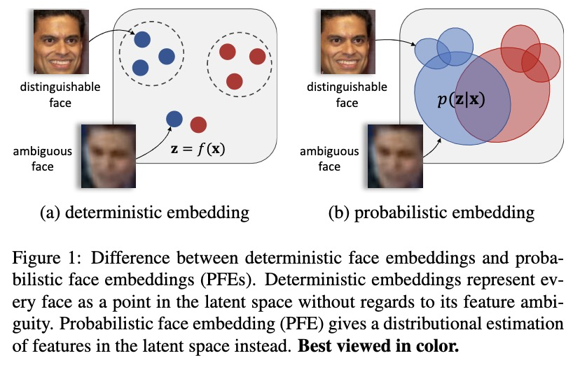

# Probabilistic Face Embeddings
### Abstract
通过在潜在语义空间中比较面部特征，嵌入方法已在面部识别中取得成功。但是，在完全不受约束的人脸设置中，嵌入模型学习到的人脸特征可能是模棱两可的，甚至可能不存在于输入人脸中，从而导致嘈杂的表示。我们提出了Probabilistic Face Embeddings(PFE)，将每个人脸图像表示为潜在空间中的高斯分布。分布的均值估计最可能的特征值，而方差显示特征值的不确定性。然后可以使用不确定性信息自然地推导出概率解，以匹配和融合PFE。 对不同基线模型，训练数据集和基准进行的经验评估表明，该方法可以将确定性嵌入转化为PFE，从而提高确定性嵌入的面部识别性能。 PFE估计的不确定性也可以作为潜在匹配准确性的良好指标，这对于风险控制的识别系统很重要。  
### 1. Introduction
&nbsp;&#160; &#160; &#160; &#160;当要求人们描述面部图像时，他们不仅要描述面部属性，还要给出与之相关的置信度。例如，如果图像中的眼睛模糊，则人会将眼睛的大小视为不确定的信息，并专注于其他特征;此外，如果图像完全损坏且无法识别属性，则对象可能会做出回应，表示他/她无法识别这张脸。这种不确定性（或置信度）估计在人类决策过程中是常见且重要的。  
&#160;&#160; &#160; &#160; &#160;现有技术中的人脸识别系统中使用的表示通常与置信度无关。 这些方法依赖于嵌入模型（例如，深度神经网络）为潜在特征空间中的每个面部图像提供确定性的点表示形式。 潜在空间中的一个点代表模型对给定图像中面部特征的估计。 如果估计中的误差受到某种程度的限制，则两点之间的距离可以有效地测量相应面部图像之间的语义相似度。 但是，如果输入的图像质量低下，而预期的面部特征在图像中却模棱两可或不存在，则不可避免的是嵌入点会发生较大变化，从而导致错误识别。  

